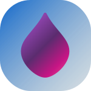

# DAR to OAR Converter(GUI & CLI)

  

  <!-- Release Badges -->
  

    
    
    
    
    
    
  

  <!-- Development Badges -->
  

    
    
    
    
    
    
  

## Getting Started for User

1. [Release Page(& Click `Assets`)](https://github.com/SARDONYX-sard/dar-to-oar/releases)

2. [Read DAR to OAR Wiki](https://github.com/SARDONYX-sard/dar-to-oar/wiki/)

## Features

- [x] DAR to OAR conversion(CLI & GUI applications)
- [x] Implemented sub commands (Remove OAR dir, Unhide DAR files)
- [x] Mapping table complements OAR's readability on GUI
- [x] Localization system(Could be customized)
- [x] Could edit JavaScript & CSS

## Licenses

DAR to OAR(This application): MIT OR Apache-2.0 Copyright (c) 2023 SARDONYX

- [MIT License](https://github.com/SARDONYX-sard/dar-to-oar/blob/main/LICENSE-MIT)

- [Apache-2.0 License](https://github.com/SARDONYX-sard/dar-to-oar/blob/main/LICENSE-APACHE)

DAR to OAR Converter v1.0.8(C# Original Application): MIT License Copyright (c)
2023 Allison Payne

- [MIT License](https://github.com/allison-payne/dar-to-oar/blob/1.0.8/LICENSE)
